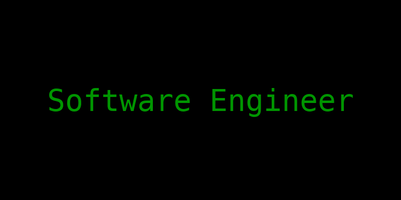

<!-- Banner -->

<h1 align="center">👋 Olá, eu sou o Amilton Junior</h1>
<h3 align="center">Desenvolvedor Front/Back END constante evolução | Java • C • HTML • CSS • Java Script</h3>

---

## 🚀 Sobre Mim
Sou um desenvolvedor apaixonado por tecnologia e pela criação de soluções práticas que facilitam o dia a dia das pessoas.  
Atualmente estou estudando **Java, lógica de programação e desenvolvimento de sistemas**, com foco em construir bases sólidas para me tornar um programador completo.

- 🔭 Estou trabalhando em pequenos projetos para fortalecer meu portfólio  
- 📘 Estudando: CIÊNCIAS DA COMPUTAÇÃO- 4ºsemestre. Com o foco em desenvolvimento de softwares ,banco de dados(sal) e web.  
- 🎯 Objetivo atual: dominar backend e criar sistemas reais do zero  
- ⚡ Fun fact: sou extremamente dedicado e aprendo muito rápido  

---

## 🛠️ Tecnologias & Ferramentas

  
  
  
  
  
  

---

## 🏆 Streaks (Dias seguidos codando)

  

---

## 🌎 Conecte-se Comigo

  
  
  

---

## 📁 Projetos em Destaque Futuramente
- Sistema de Controle de Gastos 💰 (Java)
- App de Tarefas (Java + Console)
- Catálogo de Produtos 📦  
- API Backend simples em Java

---

<h3 align="center">🚀 Obrigado por visitar meu perfil!</h3>
